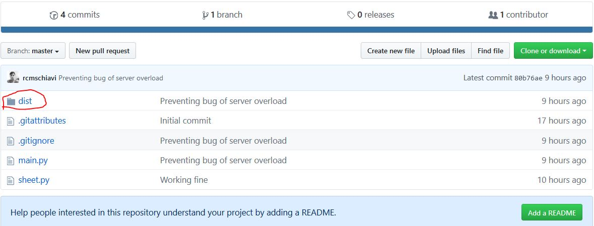
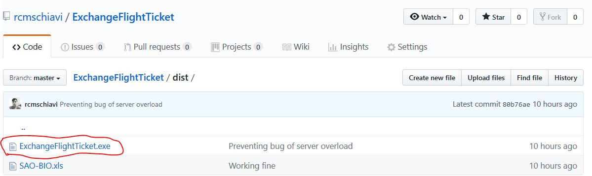
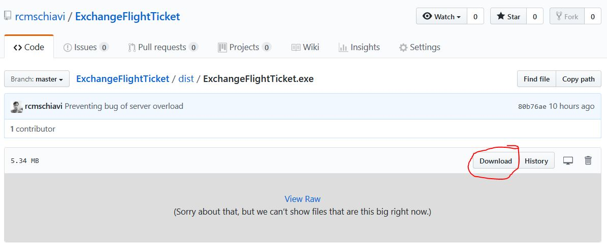
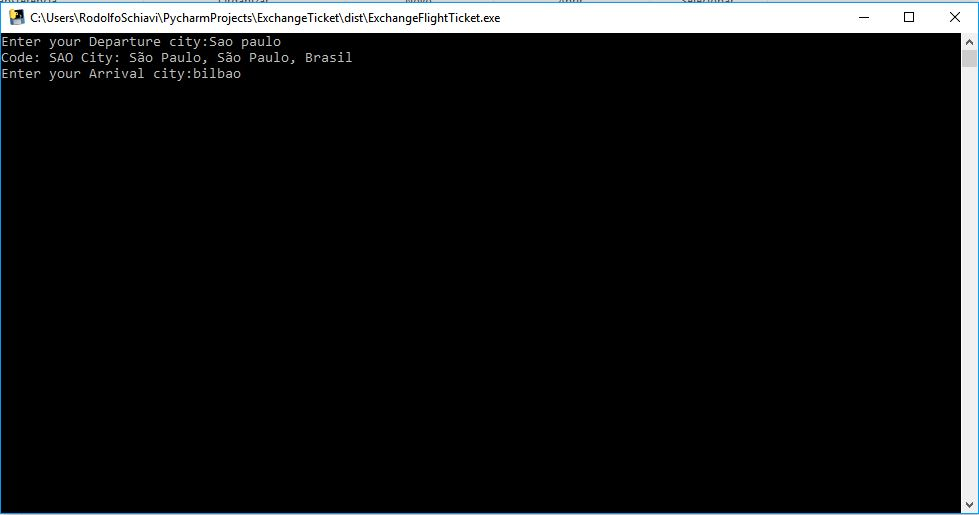
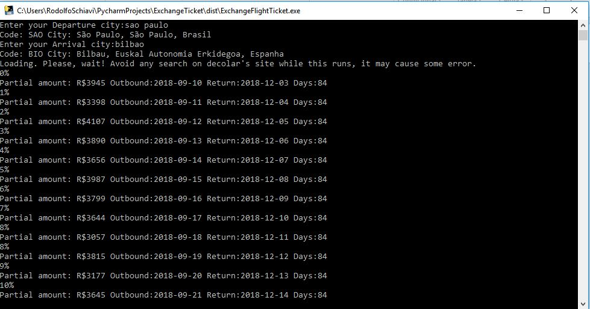
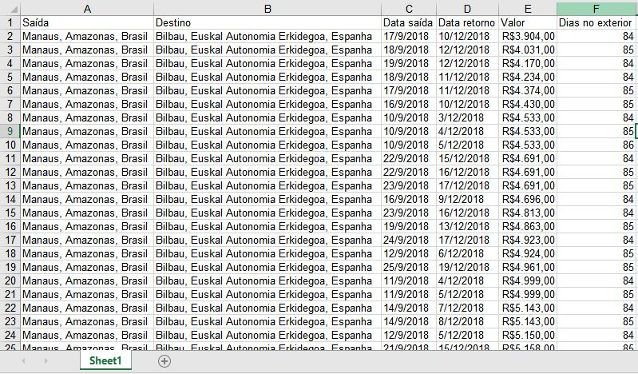

# Exchange Flight Ticket

Exchange flight ticket is a script made for scrapping flight tickets for students of the exchange program Propicie 14 from Instituto Federal de Santa Catarina, 
looking for the best combination of price and day trip. Just put the departure city
and the arrival one, and it'll you create a excel file with all the flights searched.

## Search

The search is made changing the outbound day between 10/09/2018 and 25/09/2018 and changing the amount of time between the outbound and return, 84 to 90 (limit
time to stay with tourist visa). Creating a combination of 112 searchs, wich would be really boring for a person to do.

### How to use
1. Download the program:

If you have no knowledge in programming, you just have to download the file "ExchangeFlightTicket.exe" at the directory "dist", image 1, click at the file, image 2, and download like the image 3. Then run the program
 and follow the next steps.

Image 1 - Directory

Image 2 - Program

Image 3 - Downloading

2. Filling in the city's field:

Now you have to put the name of your departure city and arrival one for the search, image 4. After filling in and pressing enter, you can confirm if the answer matches
with your desire. If the city is different, close the program, open again and try to put another information, like the country of the city. 
Other possibility is a typo and find no matches, then you can try again.

Image 4 - Filling in with the cities

3. Wait:

Just wait a few minutes until it completes all the requests. The time will depend on your internet speed. 

Image 5 - Loading...

4. Results:

After completing the search, you can open the file created, image 6, following the final program instruction, wich will inform where it is and the name's file.

Image 6 - Results.

## Possible errors

If you had some problems like the program closing, maybe you openned the excel (Don't do that!) file while the search was running or the internet connection is not good.

## Final thoughts

This was a especific and hurried project, so may doesn't satisfy your needs, but if you're a programmer you can easily make some changes.

If you found some bugs, please contact me. Or if you're a programmer, you can fix them for me ;)

### Como contribuir:

1. Crie um Fork.
2. Para trabalhar em uma proposta, crie um branch (`git checkout -b proposta_x`)
3. Commit (`git commit -m "Descrição da proposta"`)
4. Push para o branch da proposta (`git push origin proposta_x`)
5. Abra uma [Pull Request]
6. Vá fazer outra coisa.